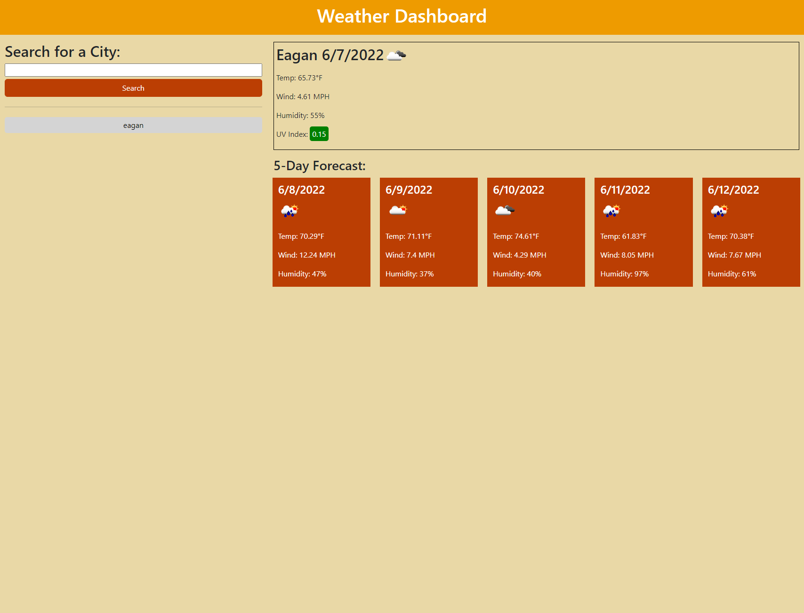

# weather-dashboard

## Description and Features
- This website allows the user to lookup the weather of the city that the user enters
- When user searches a city, it will return an in-depth description of the current day's weather AND show a 5 day forecast
- The user can then look at their previous searches and click on the previous search to view that city's weather

## Citations
- Got weather data from https://openweathermap.org/api/one-call-api
- Got UV Index information from the World Health Organization

### Screenshot and Link to Deployed site

- https://jschaefmn.github.io/weather-dashboard/
